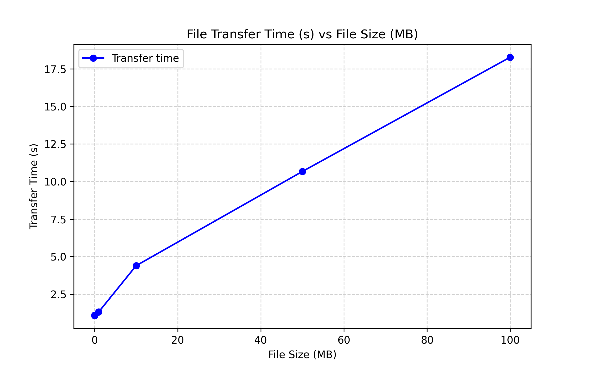

On the graph, the first two data points (256 B and 1 KB) have a steeper slope than the others. This indicates that there is a bottleneck for very small files. This is probably caused by the small buffer size (256 B), as each file is sent in many tiny pieces. 
For larger files, this bottleneck isn't as significant, so the slope flattens out. Increasing the buffer size would reduce this bottleneck and make the small-file transfers faster. The plot is below:

Link to GitHub Repo: 
